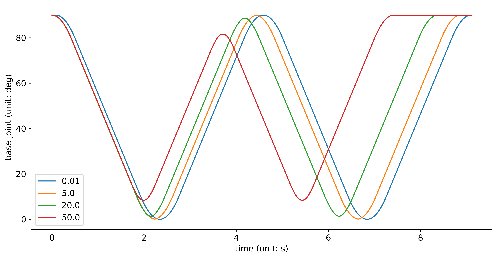

# RBPodo

<p>
<a href="https://github.com/RainbowRobotics/rbpodo/actions">

</a>
<a href="https://github.com/RainbowRobotics/rbpodo/issues">

</a>
<a href="https://github.com/RainbowRobotics/rbpodo/releases">

</a>
<a href="https://github.com/RainbowRobotics/rbpodo/blob/main/LICENSE">

</a>
<a href="https://github.com/RainbowRobotics/rbpodo/blob/main/LICENSE">

</a>
</p>

> :warning: **Note:** The API is currently under development and is subject to change.

This is a client library for Rainbow Robotics' cobots [RB-Series](https://www.rainbow-robotics.com/en_rb). It is
compatible with C++17.

You can find the documentation [here](./docs/overview.md).

---

## Installation

To build ``rbpodo`` using CMake, just run

```bash
mkdir build
cd build
cmake -DCMAKE_BUILD_TYPE=Release ..
make
```

To install ``rbpodo`` for integrating your program, you just run

```bash
sudo make install
```

In your CMake project, you can include and link ``rbpodo``

```cmake
find_package(rbpodo REQUIRED)
target_link_libraries(<YOUR TARGET> rbpodo::rbpodo)
```

``rbpodo`` is also available as a Python module. You can install it from [PyPI](https://pypi.org/project/rbpodo/) via

```bash
pip install rbpodo
```

Or you can build and install Python module from source via

```bash
pip install .
```

## Basic Example

You can find examples [here](./examples/README.md).

### C++

```c++
#include <iostream>
#include "rbpodo/rbpodo.hpp"

using namespace rb;

int main() {
  try {
    // Make connection
    podo::Cobot robot("10.0.2.7");
    podo::ResponseCollector rc;

    robot.set_operation_mode(rc, podo::OperationMode::Simulation);
    robot.set_speed_bar(rc, 0.5);

    // Move robot in joint space
    robot.move_j(rc, {100, 0, 0, 0, 0, 0}, 200, 400);
    if (robot.wait_for_move_started(rc, 0.1).type() == podo::ReturnType::Success) {
      robot.wait_for_move_finished(rc);
    }
    // If there is any error during above process, throw exception error
    rc.error().throw_if_not_empty();
  } catch (const std::exception& e) {
    std::cerr << e.what() << std::endl;
    return 1;
  }
  return 0;
}
```

### Python

```python
import rbpodo as rb
import numpy as np

ROBOT_IP = "10.0.2.7"


def _main():
    try:
        robot = rb.Cobot(ROBOT_IP)
        rc = rb.ResponseCollector()

        robot.set_operation_mode(rc, rb.OperationMode.Simulation)
        robot.set_speed_bar(rc, 0.5)

        robot.move_j(rc, np.array([100, 0, 0, 0, 0, 0]), 200, 400)
        if robot.wait_for_move_started(rc, 0.1).type() == rb.ReturnType.Success:
            robot.wait_for_move_finished(rc)
        rc.error().throw_if_not_empty()
    except Exception as e:
        print(e)
    finally:
        pass


if __name__ == "__main__":
    _main()
```

#### Joint Blending Move

```python
blending_value = [0.01, 5.0, 20.0, 50.0]
q = []
for bv in blending_value:
    robot.move_jb2_clear(rc)
    robot.move_jb2_add(rc, np.array([90, 0, 0, 0, 0, 0]), 100, 100, bv)
    robot.move_jb2_add(rc, np.array([0, 0, 0, 0, 0, 0]), 100, 100, bv)
    robot.move_jb2_add(rc, np.array([90, 0, 0, 0, 0, 0]), 100, 100, bv)
    robot.move_jb2_run(rc)

    data = []
    if robot.wait_for_move_started(rc, 0.1).type() == rb.ReturnType.Success:
        while robot.wait_for_move_finished(rc, 0.).type() == rb.ReturnType.Timeout:
            data.append(data_channel.request_data().sdata.jnt_ref)
            time.sleep(0.01)
        q.append(np.squeeze(np.array(data)[:, 0]))
q = np.vstack([np.hstack((e, np.tile(e[-1], max([e.shape[0] for e in q]) - e.shape[0]))) for e in q])
```

You can plot ``q`` via ``plt.plot(np.arange(0, q.shape[1]) * 0.01, np.transpose(q))``



## Advanced Topic

> :warning: **Note:** This is experimental feature. Be careful when you use this.


### Realtime script

``rt_script()`` allows for the direct integration of custom scripts into the real-time control loop executed within the
control box of robotic arm systems. By enabling computation to be carried out locally within the control box, it
significantly reduces communication latency associated with the updating of variables crucial for the arm's operation.
For instance, variables related to the feedback loop—such as joint positions and electrical current measurements—can be
computed directly in the control box. 

The following is the part of [example](./examples/rt_script.cpp).
```c++
robot.eval(rc, "var count = 0");

robot.rt_script_onoff(rc, true);
robot.rt_script(rc, "count += 1");

for ( ... ) {
  std::string count_str;
  robot.print_variable(rc, "count", count_str);
  ...
}

robot.eval(rc, "var count = 0");
```
