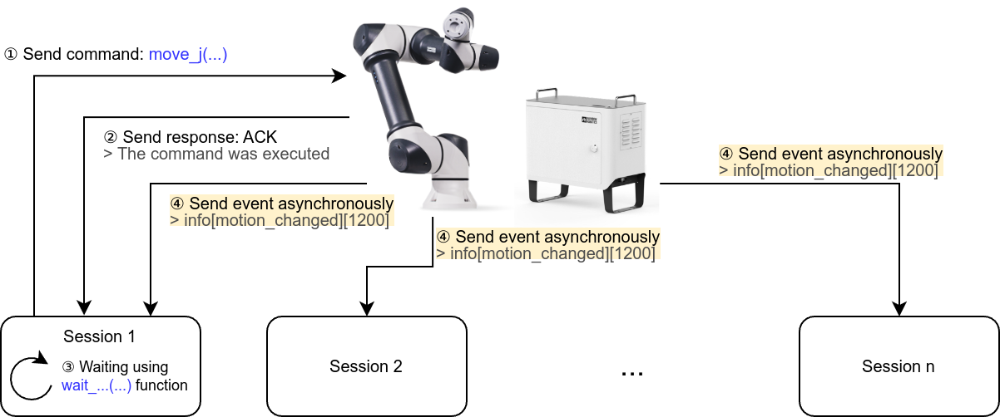
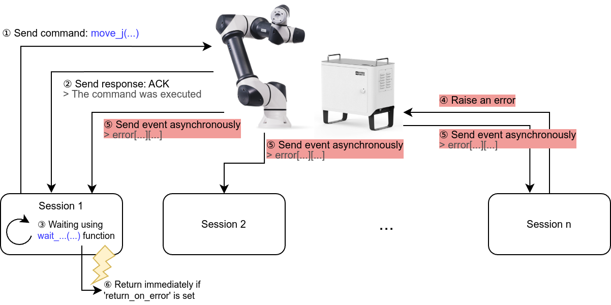

# RBPodo

<p>
<a href="https://github.com/RainbowRobotics/rbpodo/actions">

</a>
<a href="https://github.com/RainbowRobotics/rbpodo/issues">

</a>
<a href="https://github.com/RainbowRobotics/rbpodo/releases">

</a>
<a href="https://github.com/RainbowRobotics/rbpodo/blob/main/LICENSE">

</a>
<a href="https://pypi.org/project/rbpodo/">

</a>
</p>

> [!WARNING]
> The API is currently under development and is subject to change.

This is a client library for Rainbow Robotics' cobots [RB-Series](https://www.rainbow-robotics.com/en_rb). It is
compatible with C++17.

You can find the documentation [here](./docs/overview.md).

---

## Installation

To build ``rbpodo`` using CMake, just run

```bash
mkdir build
cd build
cmake -DCMAKE_BUILD_TYPE=Release ..
make
```

To install ``rbpodo`` for integrating your program, you just run

```bash
sudo make install
```

In your CMake project, you can include and link ``rbpodo``

```cmake
find_package(rbpodo REQUIRED)
target_link_libraries(<YOUR TARGET> rbpodo::rbpodo)
```

``rbpodo`` is also available as a Python module. You can install it from [PyPI](https://pypi.org/project/rbpodo/) via

```bash
pip install rbpodo
```

Or you can build and install Python module from source via

```bash
pip install .
```

## Basic Example

You can find examples [here](./examples/README.md).

### C++

```c++
#include <iostream>
#include "rbpodo/rbpodo.hpp"

using namespace rb;

int main() {
  try {
    // Make connection
    podo::Cobot robot("10.0.2.7");
    podo::ResponseCollector rc;

    robot.set_operation_mode(rc, podo::OperationMode::Simulation);
    robot.set_speed_bar(rc, 0.5);

    robot.flush(rc);
    
    // Move robot in joint space
    robot.move_j(rc, {100, 0, 0, 0, 0, 0}, 200, 400);
    if (robot.wait_for_move_started(rc, 0.1).type() == podo::ReturnType::Success) {
      robot.wait_for_move_finished(rc);
    }
    // If there is any error during above process, throw exception error
    rc.error().throw_if_not_empty();
  } catch (const std::exception& e) {
    std::cerr << e.what() << std::endl;
    return 1;
  }
  return 0;
}
```

### Python

```python
import rbpodo as rb
import numpy as np

ROBOT_IP = "10.0.2.7"


def _main():
    try:
        robot = rb.Cobot(ROBOT_IP)
        rc = rb.ResponseCollector()

        robot.set_operation_mode(rc, rb.OperationMode.Simulation)
        robot.set_speed_bar(rc, 0.5)

        robot.flush(rc)

        robot.move_j(rc, np.array([100, 0, 0, 0, 0, 0]), 200, 400)
        if robot.wait_for_move_started(rc, 0.1).type() == rb.ReturnType.Success:
            robot.wait_for_move_finished(rc)
        rc.error().throw_if_not_empty()
    except Exception as e:
        print(e)
    finally:
        pass


if __name__ == "__main__":
    _main()
```

#### Joint Blending Move

```python
blending_value = [0.01, 5.0, 20.0, 50.0]
q = []
for bv in blending_value:
    robot.move_jb2_clear(rc)
    robot.move_jb2_add(rc, np.array([90, 0, 0, 0, 0, 0]), 100, 100, bv)
    robot.move_jb2_add(rc, np.array([0, 0, 0, 0, 0, 0]), 100, 100, bv)
    robot.move_jb2_add(rc, np.array([90, 0, 0, 0, 0, 0]), 100, 100, bv)
    robot.move_jb2_add(rc, np.array([0, 0, 0, 0, 0, 0]), 100, 100, bv)
    robot.move_jb2_add(rc, np.array([90, 0, 0, 0, 0, 0]), 100, 100, bv)

    robot.flush(rc)
    robot.move_jb2_run(rc)

    data = []
    if robot.wait_for_move_started(rc, 0.5).type() == rb.ReturnType.Success:
        while robot.wait_for_move_finished(rc, 0.).type() == rb.ReturnType.Timeout:
            data.append(data_channel.request_data().sdata.jnt_ref)
            time.sleep(0.01)
        q.append(np.squeeze(np.array(data)[:, 0]))
q = np.vstack([np.hstack((e, np.tile(e[-1], max([e.shape[0] for e in q]) - e.shape[0]))) for e in q])
```

You can plot ``q`` via ``plt.plot(np.arange(0, q.shape[1]) * 0.01, np.transpose(q))``


### ``Wait`` functions

We provide ``wait`` functions for convenient external control. However, to achieve the intended behavior, it is
necessary to understand the mechanism and use the ``wait`` functions accurately.
Processes and the control box exchange commands and data through port 5000.
After an external process sends a command, the control box sends back an ACK message indicating that the command has
been executed (as shown in steps 1 and 2 in the dialog below).
Afterward, whenever an event occurs (such as the start or end of move), the corresponding event message is delivered to
all connected processes. The ``wait`` function operates by parsing this event message to check if a certain condition
has been met.



If only one process is connected to the control box, this is generally not a problem. However, if multiple processes (or
multiple computers) are connected, it may not work as expected. For example, in the illustration below, if while the
``wait_for_move_finished`` function is checking in process 1, some other process triggers an error unrelated to move (
such as trying to read a nonexistent variable), the control box will send an error message to all connected processes.
In such cases, the ``wait`` function (if ``return_on_error`` is true) will assume an error has
occurred and immediately return.



To solve this problem, one can either repeatedly check whether an error is related to movement or check whether the
robot's state is idle. (or you can check though port 5001 data channel.)

```python
while robot.get_robot_state(rc)[1] == rb.RobotState.Moving:
    time.sleep(1.0e-3)
```

Additionally, due to this mechanism, before using ``wait`` function, it is necessary to flush all messages in the
buffer (a storage for messages from the control box that have not yet been processed) to avoid the program mistaking the
result of a previous move (or command) for the result of the current command.

## Advanced Topic

> [!WARNING]
> This is experimental feature. Be careful when you use this.

### Realtime script

``rt_script()`` allows for the direct integration of custom scripts into the real-time control loop executed within the
control box of robotic arm systems. By enabling computation to be carried out locally in the control box, it
significantly reduces communication latency associated with the updating control output to robot arm.
For instance, variables related to the feedback loop—such as joint positions and electrical current measurements—can be
accessed directly in the control box.

The following is the part of [example](./examples/rt_script.cpp).

```c++
robot.eval(rc, "var count = 0");

robot.rt_script_onoff(rc, true);
robot.rt_script(rc, "count += 1");

for ( ... ) {
  std::string count_str;
  robot.print_variable(rc, "count", count_str);
  ...
}

robot.eval(rc, "var count = 0");
```
